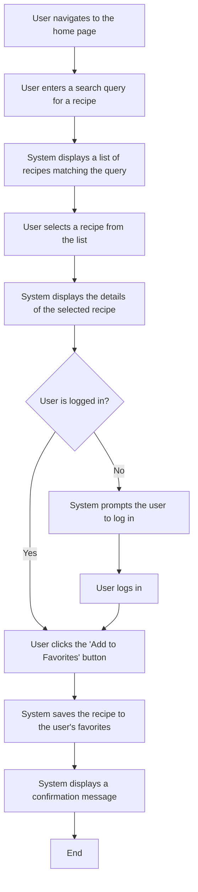

```mermaid
graph TD
    A[User navigates to the home page] --> B[User enters a search query for a recipe];
    B --> C[System displays a list of recipes matching the query];
    C --> D[User selects a recipe from the list];
    D --> E[System displays the details of the selected recipe];
    E --> F{User is logged in?};
    F -- Yes --> G[User clicks the 'Add to Favorites' button];
    G --> H[System saves the recipe to the user's favorites];
    H --> I[System displays a confirmation message];
    I --> J[End];
    F -- No --> K[System prompts the user to log in];
    K --> L[User logs in];
    L --> G;
```