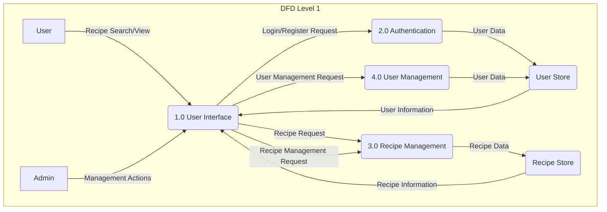

```mermaid
graph TD
    subgraph "DFD Level 1"
        User -- "Recipe Search/View" --> P1(1.0 User Interface)
        P1 -- "Login/Register Request" --> P2(2.0 Authentication)
        P2 -- "User Data" --> DS1(User Store)
        P1 -- "Recipe Request" --> P3(3.0 Recipe Management)
        P3 -- "Recipe Data" --> DS2(Recipe Store)
        DS2 -- "Recipe Information" --> P1
        DS1 -- "User Information" --> P1

        Admin -- "Management Actions" --> P1
        P1 -- "User Management Request" --> P4(4.0 User Management)
        P4 -- "User Data" --> DS1

        P1 -- "Recipe Management Request" --> P3
    end
```