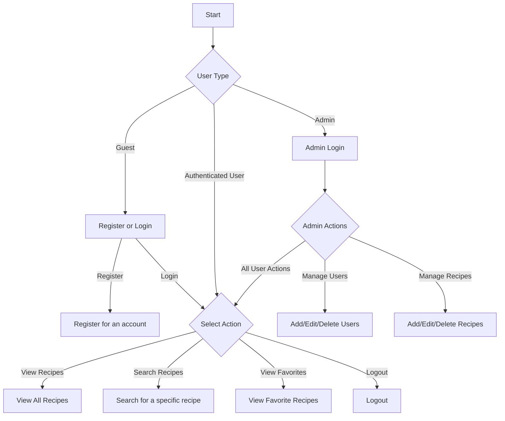

```mermaid
graph TD
    A[Start] --> B{User Type};
    B -- Guest --> C[Register or Login];
    C -- Register --> D[Register for an account];
    C -- Login --> E{Select Action};

    B -- Authenticated User --> E;
    E -- View Recipes --> F[View All Recipes];
    E -- Search Recipes --> G[Search for a specific recipe];
    E -- View Favorites --> H[View Favorite Recipes];
    E -- Logout --> I[Logout];

    B -- Admin --> J[Admin Login];
    J --> K{Admin Actions};
    K -- Manage Users --> L[Add/Edit/Delete Users];
    K -- Manage Recipes --> M[Add/Edit/Delete Recipes];
    K -- All User Actions --> E;
```